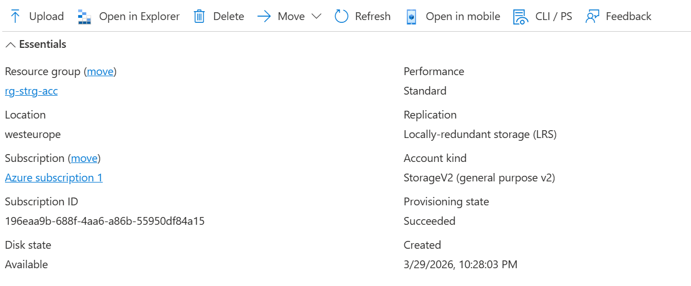
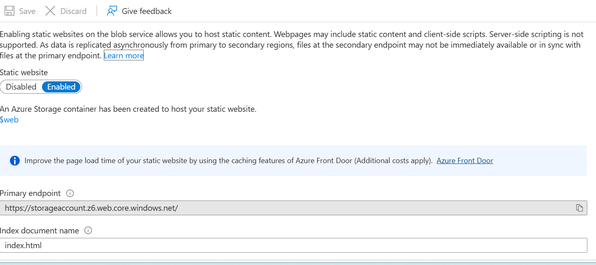
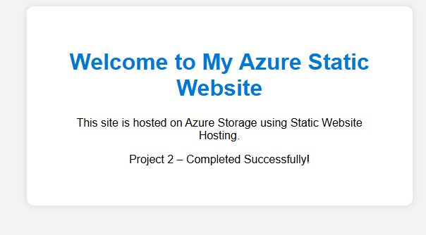
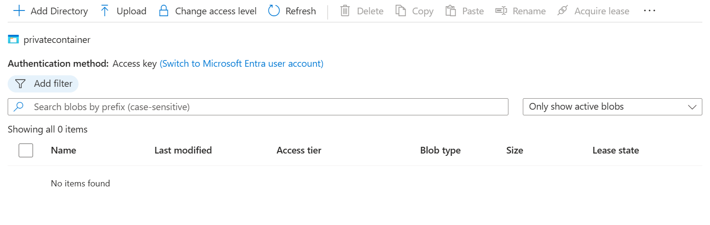
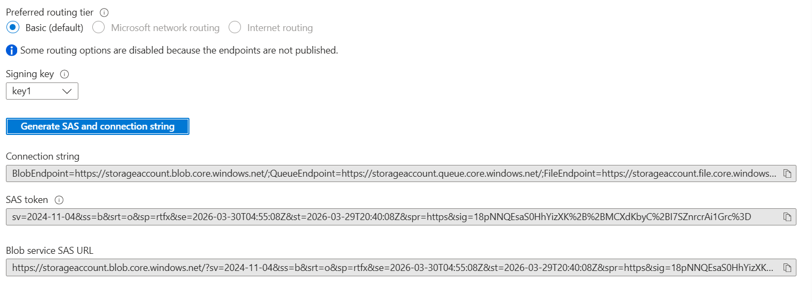
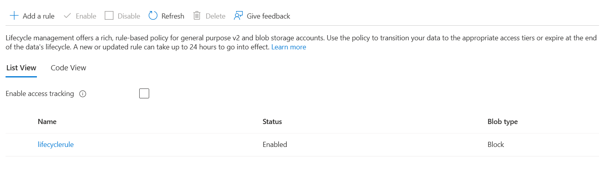

# Storage Account + Static Website + SAS + Lifecycle Rules
A hands‑on cloud engineering project demonstrating Azure Storage, Static Website Hosting, SAS security, and lifecycle automation.

## Project Overview
This project showcases the deployment and configuration of an Azure Storage Account to host a static website, manage private blob data, implement secure access using SAS tokens, and enforce automated lifecycle rules for cost‑efficient storage management.

It demonstrates real‑world Azure administration skills, including:
. Storage account provisioning
. Static website hosting
. Container access control
. Secure data access using Shared Access Signatures (SAS)
. Lifecycle management for blob tiering and retention
. Documentation and validation through screenshots

This project is part of my cloud engineering portfolio, designed to reflect practical, job‑ready Azure skills.

## Architecture Summary
The solution includes:
. Azure Storage Account (LRS, West Europe)
. Static Website Hosting enabled
. $web container for public website files
. Private container for restricted data
. SAS token for secure, time‑limited access
. Lifecycle rules for automated blob tiering and deletion

Azure Storage Architecture – Static Website + SAS + Lifecycle Rules

+---------------------------------------------------------------+
|                       Azure Storage Account                   |
|---------------------------------------------------------------|
|                                                               |
|   +-------------------+      +-----------------------------+  |
|   |   $web Container  |      |   private-data Container    |  |
|   |-------------------|      |-----------------------------|  |
|   | - index.html      |      | - Private blobs             |  |
|   | - Static website  |      | - No anonymous access       |  |
|   +-------------------+      +-----------------------------+  |
|                                                               |
|   Lifecycle Management:                                       |
|     • Move to Cool tier after 30 days                         |
|     • Delete after 365 days                                   |
|                                                               |
+---------------------------------------------------------------+

                 |                               |
                 | HTTPS                          | SAS Token (Read)
                 v                               v

+------------------------+          +-----------------------------+
|   User Browser         |          |  Secure Blob Access via     |
|   (Public Website)     |          |  SAS URL (Time-limited)     |
+------------------------+          +-----------------------------+

 What I Built
1. Storage Account Creation
Region: West Europe
Redundancy: LRS
Purpose: Host static website + private blob data

2. Static Website Hosting
Enabled static website feature

Uploaded index.html to $web container

Verified live website via primary endpoint

3. Private Blob Container
Created container: private-data

Access level: Private (no anonymous access)

4. SAS Token Generation
Configured a read‑only SAS token for secure access to private blobs.

Allowed service: Blob

Resource type: Object

Permission: Read

5. Lifecycle Management Rules
Implemented automated storage optimization:

Move to Cool tier after 30 days

Delete blobs after 365 days

 Validation
All features were tested and verified:

Static website loads successfully

Private container blocks anonymous access

SAS token grants temporary read access

Lifecycle rule created and active

### Skills Demonstrated
. Azure Storage Account administration
. Static website hosting
. Blob access control
. SAS token security
. Lifecycle management
. Cloud documentation best practices

###  Next Steps 
I will like to expand this project later on the following:

. Add CDN integration
. Add custom domain + HTTPS
. Add logging & monitoring
. Add versioning for blob data
